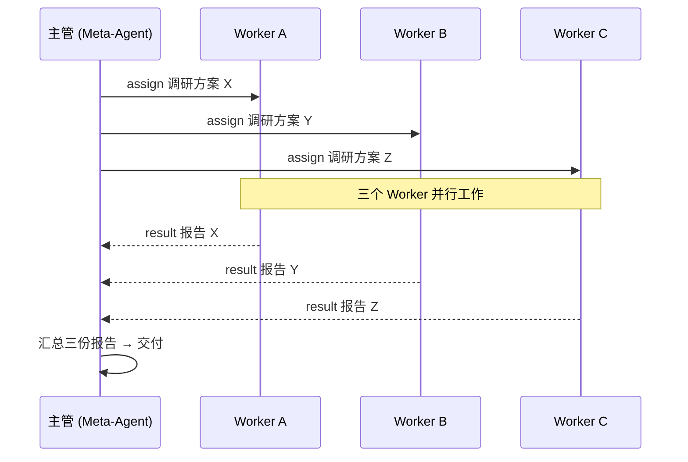

# Pan

> 🤖 一个入口，管所有任务。只跟一个「Meta-Agent 总管」对话，它拆解并调度多个 Worker 并行干活——同一个项目的子任务、多个项目、乃至生活琐事，你随时可以旁观、插话、接管。

**技术栈**：Python 3.14 + FastAPI + WebSocket + SQLite（FTS5）+ 可选 ML 向量检索

---

## 🧭 它是做什么的？（三句话讲明白）

单体的 AI 编程助手是"一对一"的：你说一句，它干一件，然后大眼瞪小眼。**Pan 让你只跟一个 Meta-Agent 对话，就能同时指挥一整支 AI 工人团队。**

- 👔 **一个主管（Meta-Agent）**：不亲自干活，负责招人、派活、听汇报、验收——像个项目经理。
- 🧑💻 **一群工人（Worker）**：每个 Worker 是一个独立运行的 AI 会话，有自己的记忆、人设和工具。
- 🧍 **你站在中间**：像站在中控室大屏前的厂长——看得见每个工人在干嘛，随时可以插话、改派，或者直接接管某个 Worker 的终端自己上手。

Pan 就是那个**调度台**：管进程、管会话、管记忆、管汇报，让"多个 AI 一起干活"从「手动在多个终端窗口之间来回切换」变成「一条有条不紊的流水线」。

## 📖 一张表看懂全部概念

| 通俗说法 | 专业概念 | 说明 |
|---------|---------|------|
| 👔 项目经理 | **Meta-Agent** | 不干活，只调度：招人、派活、听汇报、验收 |
| 🧑💻 全职员工 | **stream Worker** | 长驻的 AI 会话，随叫随到，可连续对话多轮，还能挂载 MCP 工具 |
| 🧳 外包临时工 | **one-shot MCP Worker** | 一次任务开一个新进程，自带全套工具箱，干完即走 |
| ⏳ "你去办这事，我就在这等" | **handoff** | 同步派发：发任务、阻塞等该任务的专属结果 |
| 📤 "这事交给你了，干完汇报" | **assign** | 异步派发：发完就去忙别的，完工后收到报告 |
| 📬 "以后有活自动派给你" | **report-subscribe** | 订阅制报告：工人完工后自动把报告投到主管的收件箱 |
| 🔗 "你归我管了" | **claim** | 建立主管 ↔ 工人的双向管理绑定 |
| 🌿 复制一个分身去试另一条路 | **branch** | 从现有 Session fork 出独立分支，继承模型/记忆/工具，互不影响 |
| 🎛️ 老板抢过键盘自己上 | **takeover** | 把 AI 会话夺回人类终端亲自接管（进程重启 + 置 held） |
| 🧠 员工的长期记忆 | **Memory** | 向量 + 全文（FTS5）混合检索，开工前自动注入相关记忆 |
| 🎭 有性格的老员工 | **Character** | 人设 + 独立记忆库，跨 Session 保持同一身份 |
| 🐕 不睡觉的监工 | **Watchdog** | 每个 Worker 配一只：卡死 / 摸鱼超时自动清理；全局级还能自动补员 |
| 🖥️ 工位监控大屏 | **Dashboard** | 网页实时围观每个 Worker 的输出 |
| 💬 用 QQ 遥控 | **QQ Bridge** | 把 QQ 消息变成给 Worker 的指令 |
| 🌐 远程办公室 | **Remote** | Cloudflare Tunnel，把调度台暴露到公网 |

## 👔 Meta-Agent：让 AI 自己当项目经理

Meta-Agent 不是某个特殊的程序，而是一个**角色**——任何一方（CodeBuddy、你的脚本、甚至另一个 Pan 会话）只要满足三个条件，就能扮演"主管"：

1. **能发指令**：通过 MCP 工具（17 个现成工具：`worker_spawn` / `worker_assign` / `worker_send` / `worker_kill` …）或 HTTP API；
2. **能收情报**：通过 WebSocket 订阅事件流（`worker.result` / `worker.status` / `worker.crashed` …）；
3. **有身份**：Pan 记录是谁在指挥，并对 Worker 做隔离，防止越权。

于是你可以让 CodeBuddy 自己当主管，只说一句：**"把这几个方向拆给 3 个 worker 并行调研，汇总成一份报告给我"**——剩下的拆解、派发、回收、汇总，主管自己完成。

## 🎯 一个入口，管理你的一切任务

Meta-Agent 真正的价值，是**你只需要跟它一个人对话**。

你可能同时在忙的，是同一项目的几个并行子任务、几个不同项目的进展、甚至和生活相关的琐事（日程、提醒、自动化）。而对 Meta-Agent 来说，它们都只是**可以并发调度的 Worker 进程**——你不必分别盯着每个终端：

```
你：项目 A 的三个模块并行开发，项目 B 的 bug 查一下，下午 3 点提醒我开会。

Meta-Agent（自动拆解 → 派活）：
├─ worker-a1 · 项目 A · 模块 1 开发
├─ worker-a2 · 项目 A · 模块 2 开发
├─ worker-a3 · 项目 A · 模块 3 开发
├─ worker-b1 · 项目 B · 排查 bug
└─ worker-l1 · 生活 · 3 点开会提醒

你（过一会儿）：汇报进展。
→ Meta-Agent 收回全部结果，汇总成一份报告。
```

对你来说，从头到尾只是一次对话；对它们来说，是一支并行协作的团队。而你随时保有最终指挥权——旁观、插话、接管，都可以。

## 📬 Managed 订阅：每个主管一个"AI 收件箱"

派出去的任务怎么收回结果？Pan 的答案是**订阅制 + 落盘队列**——把"逐个追问"变成"自动投递"：

- **订阅即接管**：订阅一个 Session 报告的同时，托管关系（claim）也一并建立——一步到位，不用分两步操作；
- **自动投递**：被托管的 Worker 每次完成（或出错），报告自动投进主管的专属收件箱（`queue_pending`），主管不用挨个去问；
- **落盘不丢**：收件箱写在磁盘上——Meta-Agent 中途掉线，重连后报告还在，一条不漏；
- **归属清晰**：每个 Session 只属于一个主管（`managed_by`），谁管的谁收，星形拓扑一目了然，别人也无法越权订阅。

所以对主管来说，管理一堆任务 = 管理一个收件箱：**派活 → 回来看收件箱 → 汇总**。

## 🤝 多智能体协作：三种典型工作流

**① 并行 fan-out（一个主管，多个工人，同时开工）**



**② 串行流水线（上一环的产出是下一环的输入）**

```
handoff(W1: 写技术方案) → 拿到方案 → handoff(W2: 写代码) → 拿到代码 → handoff(W3: 代码 review)
```

每一步同步等待结果再走下一步，像工厂流水线一样可控。

**③ 长期共事（带记忆的老团队）**

给 Worker 挂上 Character（人设 + 记忆库）和 Memory 目录后，每次开工 Pan 都会把相关记忆自动注入上下文——你的 AI 团队会**记住项目背景、记住你的偏好**，而不是每次都从零开始。

## ✨ 它凭什么值得一试

- 🛡️ **自愈的调度台**：Worker 卡死？Watchdog 自动清理（默认 5 分钟超时）；进程异常死亡？落盘队列会自动重建 Worker 接着干。
- 📬 **Managed 订阅收件箱**：每个主管都有一个落盘收件箱，被托管的 Worker 完工自动投递报告——派完活不用盯，回来看一眼收件箱就行。
- 🖐️ **人与 AI 平等**：任何一个 Worker，你都能随时中断、接管终端、fork 分身，或者直接上手。
- 🚪 **跨通道指挥**：Dashboard、QQ、公网隧道、MCP——同一个调度台，从哪儿都能进来管。
- 🧩 **可当"工具底座"**：外部领域项目可以把服务接入 Pan，让 Pan 的 QQ Bot 和 Worker 替它打工（首个案例：RuleWhisper）。

---

## 功能总览

- **Worker 生命周期管理** — 双模式：`stream`（长驻会话，可挂载 MCP）与 `one-shot MCP`（一次性任务）；支持 spawn / task / kill / restart / branch / interrupt / takeover / rename / settings / settings 更新。
- **Watchdog 自愈** — worker 级：静默超时 kill（`worker.timeout_sec`，默认 300s）、空闲回收（`worker.idle_sec`，默认 300s），held/zombie 跳过；全局级：落盘队列自愈（进程异常死亡后自动重建 worker）。
- **Session 管理** — 持久化 `ses_<16hex>`，独立于 Worker 生命周期；CRUD、历史分页、分支（fork）、批量删除。
- **编排 API** — `handoff`（同步阻塞 + taskId 幂等）、`assign`（异步派发）、`report-subscribe`（订阅制报告推送）、`claim`（managed 关系绑定）。
- **Character / Profile 框架** — `manifest.json`（或外部 `plugin_manifests`）声明模板 → 创建带独立记忆库的 Character 实例。
- **Memory 子系统** — SQLite + FTS5 + embedding 混合检索；知识文件索引、运行中自动注入；embedding 多 provider（sentence-transformers 默认 / openai / ollama / llama.cpp GGUF）；jieba 中文分词、watchdog 文件监控、批量向量评分。
- **MCP Server** — 17 个工具（session / worker / report / model / handbook），带 MCP 隔离检查与 `////by agent` 来源前缀；支持 stdio / SSE / streamable-http。
- **多通道接入** — Web（Dashboard + HTTP/WS API）、QQ（NoneBot2 + OneBot v11）、Remote（Cloudflare Tunnel）、Meta-Agent（WS + MCP）。
- **CLI Adapter 抽象** — `cbc`（stream-json 协议 + one-shot MCP）、`kimi`；会话导入（cbc / kimi 历史导入）。
- **文件系统 API** — session workdir 内 list / read / write / rename / delete，带路径逃逸校验。

---

## 项目框架

```
Pan/
├── main.py                    入口（uvicorn 启动 FastAPI app，默认 127.0.0.1）
├── config.json                配置文件（gitignored；复制 config.example.json 生成）
├── config.example.json        配置模板（字段含默认值说明）
├── manifest.json              内置 session_templates / character_templates / mcp_servers / command_routes
├── importantInfo.md           端口、启动顺序等关键信息速查
├── requirements.txt           全功能依赖（核心 + Memory 等可选功能）
├── minimal-requirements.txt   最小依赖（仅核心，快速开始推荐）
├── packages/
│   ├── core/                  Core 模块（进程管理 + 消息路由 + Memory）
│   │   ├── worker.py          Worker 生命周期（stream / one-shot MCP 双模式 + watchdog）
│   │   ├── session.py         Session 存储（JSON）
│   │   ├── config.py          配置加载（默认值 + 深合并）
│   │   ├── character.py       Character 框架（profile → character → memory）
│   │   ├── manifest_loader.py 插件 manifest 加载器（${PLUGIN_DIR} 解析）
│   │   ├── memory_context.py  记忆上下文注入（search_and_format）
│   │   ├── memory/            Memory 子系统（SQLite + FTS5 + embedding 混合检索）
│   │   └── adapters/          CLI Adapter（cbc / kimi）
│   ├── web/                  Web 通道（FastAPI + WebSocket + Dashboard）
│   │   ├── server.py          FastAPI 路由 + WebSocket（51 个 HTTP 端点）
│   │   ├── ts/                Legacy TypeScript 源码（→ static/）
│   │   ├── static/            Legacy 编译产物 + CSS（gitignored）
│   │   ├── src/               React SPA 源码（开发主力）
│   │   ├── dist/              Vite 构建产物（gitignored）
│   │   └── package.json
│   ├── qq/                   QQ 通道（NoneBot2 桥接 + 独立 requirements.txt）
│   ├── remote/               远程通道（Cloudflare Tunnel + 状态服务）
│   ├── mcp/                  MCP Server（17 个工具，可独立启动）
│   └── scripts/              运维脚本（monitor_workers.py 等）
├── scripts/                   启动/停止/隧道/预提交脚本
├── docs/                      文档（全部纳入 git 跟踪；archive/ 为历史存档）
├── tests/                     测试（17 个文件，覆盖 worker / mcp / memory / character / adapter）
└── data/                      运行时数据（gitignored：sessions / characters / memory / workdirs / logs）
```

---

## 快速开始

前置要求：Python 3.14、Node.js + npm（编译 legacy 前端）。

```bash
# 1. 安装最小依赖（仅核心，不含 Memory ML 链）
pip install -r minimal-requirements.txt

# 2. 生成配置
cp config.example.json config.json
# Windows: copy config.example.json config.json
# 按需修改 config.json（端口、模型等；全部字段可选）

# 3. 编译 vanilla（legacy）前端：TS 源码 → static/js/app.js
#    必须在项目根执行（用根 tsconfig，而非 packages/web 的 React tsconfig）
npx tsc

# 4. 启动
python main.py
# → http://127.0.0.1:8768   （main 分支默认 8768；test 分支 8767；可用 PAN_PORT 覆盖）

# 5. 运行测试
python -m pytest tests/ -q
```

### React 前端（开发中）

另有 React SPA 正在开发（`packages/web/src/`），构建方式如下：

```bash
cd packages/web
pnpm install          # 首次
pnpm build            # 产物 → packages/web/dist/
pnpm dev              # 开发模式：Vite HMR + 代理到后端
```

访问路由由 `config.json` 的 `frontend` 字段控制：

| frontend | 行为 |
|----------|------|
| `coexist`（默认） | `/` 旧前端 + `/react/` React SPA |
| `react` | React 接管 `/` |
| `legacy` | 仅旧前端 |

> 后端 API/WS 优先为 React 演化；若后端变更破坏 legacy 前端，改 `ts/app.ts` 跟随，不约束后端。

---

## 可选依赖（按需安装）

`requirements.txt`（全功能）已包含以下所有可选依赖；若使用 `minimal-requirements.txt`（仅核心），则按需自行安装：

| 依赖 | 启用功能 | 安装命令 |
|:-----|---------|:--------|
| `sentence-transformers` | Memory 向量检索（web 端默认 embedding provider） | `pip install sentence-transformers` |
| `watchdog` | Memory 文件监控（自动索引 .md 变更） | `pip install watchdog` |
| `openai` | Memory 向量检索的 OpenAI embeddings provider（需 `OPENAI_API_KEY`） | `pip install openai` |
| `llama-cpp-python` | Memory 向量检索的本地 GGUF embeddings provider | `pip install llama-cpp-python` |
| `jieba` | Memory 中文分词（提升 FTS5 关键词匹配质量；缺省降级为空白切分） | `pip install jieba` |
| `numpy` | Memory 批量向量评分加速（缺省降级为纯 Python） | `pip install numpy` |
| `tiktoken` | Memory token 估算（缺省降级为长度估算） | `pip install tiktoken` |

未安装时相关功能自动降级或禁用（代码内均有懒加载 + ImportError 兜底），不影响 Core 启动。

---

## 配置

配置文件：仓库根 `config.json`（gitignored）。所有字段可选，省略时使用 `packages/core/config.py` 内置默认值。完整字段与说明见 `config.example.json`（每项带 `_字段说明`）。

| 配置 | 默认值 | 说明 |
|------|--------|------|
| `port` | 8768 | 主服务端口（main 分支）；test 分支 8767 |
| `frontend` | `coexist` | `coexist` / `react` / `legacy` |
| `cbc.model` | `deepseek-v4-flash` | cbc 模型（flash/pro/hy3/glm/kimi 等，见 example） |
| `cbc.permission_mode` | `bypassPermissions` | cbc 权限模式 |
| `kimi.model` | `kimi-code/kimi-for-coding` | kimi 模型 |
| `worker.timeout_sec` | 300 | 静默超时 kill 秒数 |
| `worker.idle_sec` | 300 | 空闲回收秒数 |
| `remote` | enabled=false | Cloudflare Tunnel 配置（quick_tunnel / config_path / status_port=8769） |
| `logging` | INFO / data/logs/pan.log | 日志级别、轮转、控制台输出 |
| `plugin_manifests` | `["manifest.json"]` | 外部 Character profiles 清单 |
| `mcp.enabled_default` | 已废弃 | MCP 启用由 session 的 `mcp_servers` 非空决定，此键无效果 |

**环境变量**：`PAN_PORT`（覆盖端口）、`PAN_HOST`（默认 127.0.0.1）、`PAN_URL`（QQ Bridge 用）、`PAN_API_URL`（MCP server 用，默认 `http://127.0.0.1:8768`）。

---

## API 一览

### HTTP（`packages/web/server.py`，51 个端点）

**Session 管理**

```
GET    /api/sessions                  → 列举所有 Session
POST   /api/sessions                  → 创建 Session
GET    /api/sessions/{id}             → 获取 Session 详情
GET    /api/sessions/{id}/history     → 获取历史消息（分页）
PATCH  /api/sessions/{id}             → 更新 Session（含 requireRestart 语义）
POST   /api/sessions/{id}/rename      → 重命名
POST   /api/sessions/{id}/branch      → 分支 Session
DELETE /api/sessions/{id}             → 删除 Session
POST   /api/sessions/batch-delete     → 批量删除
```

**Worker 管理**

```
POST   /api/spawn                     → 启动新 Worker
POST   /api/task                      → 向 Worker 发送任务
POST   /api/kill/{worker_id}          → 停止 Worker
GET    /api/list                       → 列举活跃 Worker
POST   /api/worker/{id}/restart       → 重启 Worker
POST   /api/worker/{id}/settings      → 更新 Worker 配置
POST   /api/worker/{id}/rename        → 重命名 Worker
POST   /api/worker/{id}/branch        → Worker 分支
POST   /api/worker/{id}/interrupt     → 中断 Worker（仅 running 时）
POST   /api/worker/{id}/takeover      → 接管 Worker 终端（重启 + 置 held）
GET    /api/worker/{id}/takeover-command → 生成接管命令（不执行）
```

**编排（4.2 / 4.3 / 4.7）**

```
POST   /api/handoff                   → 同步阻塞派发（taskId 幂等）
POST   /api/assign                    → 异步派发任务
POST   /api/report-subscribe          → 订阅 Worker 报告
POST   /api/report-unsubscribe        → 退订报告
POST   /api/claim                     → 绑定 managed 关系
```

**Character / Memory**

```
GET    /api/characters/profiles       → 列出可用 Profile（session templates）
GET    /api/manifest/command-routes   → 列出 QQ 命令路由
GET    /api/characters                → 列出 Character
POST   /api/characters                → 创建 Character
GET    /api/characters/{id}           → 获取 Character 详情
DELETE /api/characters/{id}           → 删除 Character
POST   /api/memory/index              → 索引记忆目录（.md → SQLite）
GET    /api/memory/search             → 混合检索记忆
GET    /api/memory/stats              → 记忆库统计
POST   /api/memory/inject             → 手动注入记忆
```

**文件系统（session workdir 内，含路径逃逸校验）**

```
GET    /api/fs/list                   → 列出目录
GET    /api/fs/read                   → 读取文件
POST   /api/fs/write                  → 写入文件
POST   /api/fs/rename                 → 重命名
POST   /api/fs/delete                 → 删除
```

**Adapter / 导入**

```
GET    /api/models?adapter=cbc        → 获取模型列表
GET    /api/adapter/config?adapter=cbc→ Adapter 配置
GET    /api/adapters                  → 列举可用 Adapter
GET    /api/cbc/projects              → CBC 项目列表
GET    /api/cbc/sessions              → CBC Session 列表
GET    /api/cbc/browse                → 浏览 CBC Session 文件
POST   /api/cbc/sessions/import       → 导入 CBC Session
GET    /api/kimi/workspaces           → Kimi Workspace 列表
GET    /api/kimi/sessions             → Kimi Session 列表
POST   /api/kimi/sessions/import      → 导入 Kimi Session
```

### WebSocket

```
WS   /ws             Dashboard：仅接收 user_inject；广播全部事件
WS   /ws/agent       Meta-Agent：subscribe（按 eventTypes/sessionIds 过滤+重连补发）、
                     reconnect、task、spawn、handoff、assign、send、kill、list
```

广播事件：`worker.stream` / `worker.result` / `worker.status` / `worker.spawned` / `worker.crashed` / `worker.zombie` / `worker.destroyed` / `worker.restarted` / `worker.reconfigured`、`session.created` / `session.updated` / `session.renamed` / `session.deleted` / `sessions.deleted`、`error`。

### MCP Server（`packages/mcp/server.py`，17 个工具）

```
session_create / session_list / session_get / session_delete / session_update / session_history
report_subscribe / report_unsubscribe
worker_spawn / worker_task / worker_kill / worker_list / worker_handoff(已弃用) / worker_assign / worker_send
model_list / pan_handbook
```

启动方式：`python -m packages.mcp.server --transport stdio|sse|streamable-http [--port 9740]`（默认 stdio，API 地址取 `PAN_API_URL`）。

---

## 通道与集成

### Web / Dashboard

- `http://127.0.0.1:{port}` — legacy Dashboard；`/react/` — React Dashboard
- `ws://127.0.0.1:{port}/ws` — Dashboard WebSocket
- `ws://127.0.0.1:{port}/ws/agent` — Meta-Agent WebSocket

### Meta-Agent（MCP）

`.codebuddy/mcp.json` 已配置 Pan MCP server（stdio）：`python -m packages.mcp.server`。

### QQ Bridge

依赖见 `packages/qq/requirements.txt`（nonebot2 + onebot-adapter-onebot + httpx）。启动顺序：

1. NapCat（正向 WS 服务端，端口 3001）
2. `python main.py`
3. `cd packages/qq && python bot.py`（NoneBot2 自带 8080 服务，不对外）

命令路由由 `manifest.json` 的 `command_routes` 声明。

### Remote（Cloudflare Tunnel）

```bash
python -m packages.remote
# 或 scripts/start_cf.ps1
```

- `quick_tunnel: true` → 输出 `*.trycloudflare.com` 临时 URL；`false` → 需 `remote.config_path` 指定 named tunnel 的 yml
- 状态服务：`curl http://127.0.0.1:8769/status`
- 公网域名来自 `config_path` 指向的 yml 的 `ingress.hostname`；tunnel 暴露的是 Pan 主端口（`config.port`）

---

## 架构

```
         Meta-Agent                   人类                    远程访问
    (CodeBuddy / MCP)           (Dashboard)            (Cloudflare Tunnel)
          │                          │                          │
   /ws/agent + MCP tools       /ws + HTTP              公网 URL + WS
    （事件流 + 命令）          （观察 + 注入 + 接管）      （Dashboard / QQ Bot 外部接入）
          │                          │                          │
          └──────────┬───────────────┘                          │
                     │                                          │
            ┌────────▼────────┐                                 │
            │  Pan Core         │◄──────────────────────────────┘
            │  (FastAPI 服务)    │        HTTP / WebSocket
            │                   │
            │  Session Manager │
            │  ├─ Worker-1     │── cbc / kimi（stream / one-shot MCP）
            │  ├─ Worker-2     │── ...
            │  └─ Worker-N     │
            │                   │
            │  Character 框架   │── profile → character → memory
            │  Memory 子系统    │── SQLite + FTS5 + embedding 检索
            │  Event Bus       │─── WS 广播
            │  Session Store   │─── JSON 持久化
            └──────────────────┘
```

---

## 重要信息备注

- **无鉴权 + 绑 loopback 是既定姿态**：API 没有任何认证，默认绑 `127.0.0.1`。把 `PAN_HOST` 改成非 loopback 会把所有端点暴露在网络上（`main.py` 启动时会告警）。安全重点在边界校验：workdir 路径逃逸校验、character_id 格式校验。
- **端口速查**：Pan 主服务 8767（test）/ 8768（main）；Remote 状态 8769；NoneBot2 8080（不对外）；NapCat 3001。详见 `importantInfo.md`。
- **Remote Tunnel 机制**：公网域名 = `remote.config_path` 指向的 yml 的 `ingress.hostname`；暴露端口 = `config.port`；由 `scripts/start_cf.ps1` 读取 config.json 注入临时 yml，**不依赖 `remote.enabled` 字段**。
- **前端双源 of truth**：legacy 源码 `packages/web/ts/app.ts`，`static/js/app.js` 是其编译产物（gitignored），**改完必须从项目根 `npx tsc`**；React 源码 `packages/web/src/`，产物 `dist/`（gitignored），**改完必须 `cd packages/web && pnpm build`**。pre-commit（`git config core.hooksPath scripts`）会同时校验两者。
- **worker 双模式判定**：`stream` 长驻（可挂载 MCP，cbc ≥ 2.137.0 的 stream-json 已支持 MCP）；`one-shot MCP` 仅在 `output_mode=oneshot` 时启用。`worker_handoff` 已弃用，用 `worker_assign` / `worker_send` 替代。
- **Memory 依赖与降级**：minimal 依赖不含 ML 链。启用 Memory 前需 `sentence-transformers`（web 端默认 provider）。各可选库缺失时懒加载 + ImportError 兜底自动降级，不影响 Core 启动；但 `jieba` 缺失会显著降低中文检索质量。
- **Python 版本**：仓库无版本声明文件（无 pyproject.toml / .python-version），实际运行环境为 Python 3.14.5。
- **worktree 无独立 .venv**：在 git worktree 里测试/运行时，统一使用主仓库的 `D:/project/Pan/.venv`。
- **测试现状**：`tests/` 17 个文件，覆盖 worker 生命周期（states/watchdog/global_watchdog/primitives/history/output_mode/cli_session_binding）、MCP（integration/isolation/handbook/agent_subscription/report_subscription）、memory（chunker/search）、character/manifest_loader、adapter（kimi/cbc_import_guard）。运行 `python -m pytest tests/ -q`。
