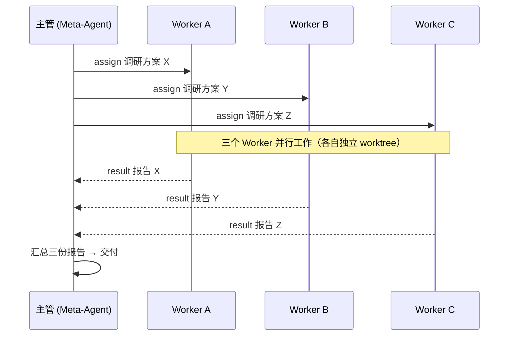

# Pan

> 🤖 一个入口，管所有任务。只跟一个「Meta-Agent 总管」对话，它拆解并调度多个 Worker 并行干活——同一个项目的子任务、多个项目、乃至生活琐事，你随时可以旁观、插话、接管。
> 底层用哪个 CLI Agent 你说了算：cbc / kimi / opencode 已协议化接入，**想换就换，上下文随行**。

**技术栈**：Python 3.14 + FastAPI + WebSocket + SQLite（FTS5）+ 可选 ML 向量检索

---

## 💡 为什么选 Pan（30 秒看懂差异化）

单体的 AI 编程助手是"一对一"的：你说一句，它干一件，然后大眼瞪小眼。**Pan 让你只跟一个 Meta-Agent 对话，就能同时指挥一整支 AI 工人团队。**

| 你想解决的问题 | Pan 的答案 |
|---------------|-----------|
| **多任务并行**：同时推进几个模块/项目，手动切换多个终端窗口 | 👔 **Meta-Agent 自动拆解派活**：拆不拆、怎么拆，编排方法论替你判断；多个 Worker 在各自独立 git worktree 里并行干活 |
| **换 CLI 就丢上下文**：从 A 助手切到 B 助手，历史对话全没了，重头再来 | 🔁 **替身交接（session_handoff）**：想换就换，新 CLI 接管整个关系网，精简摘要随行——同任务跨 CLI 无缝继续，还省上下文 |
| **一个厂商锁死**：模型/助手被某个 CLI 生态绑定 | 🔌 **多 CLI 协议化适配**：cbc / kimi / opencode 已支持，集群对底层 CLI 无感知，写模型规则就能让 Meta-Agent 按任务类型路由到合适的 adapter |
| **AI 没有记忆**：每次开工都要重新交代背景和偏好 | 🧠 **Memory + Character**：向量 + 全文混合检索，开工自动注入相关记忆；人设跨 Session 保持同一身份 |
| **AI 干到一半卡死**：进程挂了、任务跑飞了没人管 | 🐕 **Watchdog 自愈**：卡死 / 静默超时自动清理；进程异常死亡，落盘队列自动重建 Worker 接着干 |
| **人不在电脑前**：想用 QQ 遥控、公网远程查看 | 🚪 **多渠道指挥**：Web Dashboard / QQ / Cloudflare 公网隧道 / MCP，同一个调度台从哪儿都能进来 |

---

## 🧭 它是做什么的？（三句话讲明白）

- 👔 **一个主管（Meta-Agent）**：不亲自干活，负责招人、派活、听汇报、验收——像个项目经理。
- 🧑💻 **一群工人（Worker）**：每个 Worker 是一个独立运行的 AI 会话，有自己的记忆、人设和工具，在**独立 git worktree** 里干活，互不干扰。
- 🧍 **你站在中间**：像站在中控室大屏前的厂长——看得见每个工人在干嘛，随时可以插话、改派，或者直接接管某个 Worker 的终端自己上手。

Pan 就是那个**调度台**：管进程、管会话、管记忆、管汇报，让"多个 AI 一起干活"从「手动在多个终端窗口之间来回切换」变成「一条有条不紊的流水线」。

## 📖 一张表看懂全部概念

| 通俗说法 | 专业概念 | 说明 |
|---------|---------|------|
| 👔 项目经理 | **Meta-Agent / SMA** | 不干活，只调度：招人、派活、听汇报、验收 |
| 🧑💻 全职员工 | **stream Worker** | 长驻的 AI 会话，随叫随到，可连续对话多轮，还能挂载 MCP 工具 |
| 🧳 外包临时工 | **one-shot MCP Worker** | 一次任务开一个新进程，自带全套工具箱，干完即走 |
| 🔌 不同的工具品牌 | **CLI Adapter** | 每种 CLI Agent 一个协议化适配器（cbc / kimi / opencode），切换不改业务层 |
| 🔁 替身接管你的工作 | **session_handoff** | 创建孪生 Session 接替旧会话：关系网 / 报告订阅 / QQ 绑定全移交，上下文精简摘要随行 |
| 📤 "这事交给你了，干完汇报" | **assign** | 异步派发：发完就去忙别的，完工后收到报告 |
| 📬 "以后有活自动派给你" | **report-subscribe** | 订阅制报告：工人完工后自动把报告投到主管的收件箱（落盘不丢） |
| 🔗 "你归我管了" | **claim** | 建立主管 ↔ 工人的双向管理绑定 |
| 🌿 复制一个分身去试另一条路 | **branch** | 从现有 Session fork 出独立分支，继承模型/记忆/工具，互不影响 |
| 🎛️ 老板抢过键盘自己上 | **takeover** | 把 AI 会话夺回人类终端亲自接管（进程重启 + 置 held） |
| 🧠 员工的长期记忆 | **Memory** | 向量 + 全文（FTS5）混合检索，开工前自动注入相关记忆 |
| 🎭 有性格的老员工 | **Character** | 人设 + 独立记忆库，跨 Session 保持同一身份 |
| 🐕 不睡觉的监工 | **Watchdog** | 每个 Worker 配一只：卡死 / 摸鱼超时自动清理；全局级还能自动补员 |
| 🖥️ 工位监控大屏 | **Dashboard** | 网页实时围观每个 Worker 的输出（React 新版 + 旧版双轨） |
| 💬 用 QQ 遥控 | **QQ Bridge** | 把 QQ 消息变成给 Worker 的指令；NapCat / LLOneBot 通道可切换 |
| 🌐 远程办公室 | **Remote** | Cloudflare Tunnel，把调度台暴露到公网 |

---

## 👔 Meta-Agent 编排：一支 AI 团队，一个主管

### SMA（Super Meta Agent）：不干活，只调度

Meta-Agent 不是某个特殊的程序，而是一个**角色**——任何一方（你的 Agent CLI、脚本、甚至另一个 Pan 会话）只要满足三个条件，就能扮演"主管"：

1. **能发指令**：通过 MCP 工具（27 个现成工具：`worker_spawn` / `worker_assign` / `worker_send` / `session_handoff` …）或 HTTP API；
2. **能收情报**：通过 WebSocket 订阅事件流（`worker.result` / `worker.status` / `worker.crashed` …），或订阅制报告落盘到自己的收件箱；
3. **有身份**：Pan 记录是谁在指挥，并对 Worker 做隔离，防止越权。

Pan 内置了 **SMA（Super Meta Agent）编排模板**（`manifest.json` 的 `session_templates.SMA`）：一键创建"超级编排代理"会话，同时挂载 Pan 核心 MCP 与 QQ 通道 MCP，拥有全权限、自动认领、自动订阅——**开箱即用的 AI 项目经理**。

### 编排方法论：从"拆不拆"到"合并汇报"

SMA 的调度不是拍脑袋派活，而是遵循一套**编排方法论**（编排工作流固化在 `docs/skills/pan/SKILL.md`，拆解判断准则写在 SMA 模板的编排原则与最佳实践中）：

1. **决策三问**——收到任务先判断拆不拆：
   - ① **能真并行吗？** 子任务相互独立、可同时跑；
   - ② **拆了更快吗？** 每个子任务值得单独一个 Worker 的投入；
   - ③ **精度关键吗？** 依赖细节保真的任务不轻易外包。
   - 三个问题任一不过 → 自己做；全过 → 并行派发。
2. **并行派发**：`worker_assign` 异步分发到多个 Worker（各自独立 git worktree，避免提交冲突），立即返回不阻塞。
3. **订阅制汇报**：`report_subscribe` 把完成报告自动投进主管的**落盘收件箱**——主管不用挨个追问，掉线重连报告一条不漏。
4. **trust-but-verify 验收**：Worker 的自述不等于事实——合并汇报前逐项核对改动、跑测试验证。
5. **合并汇报**：收回全部结果，汇总成一份交付。

```
你：项目 A 的三个模块并行开发，项目 B 的 bug 查一下，下午 3 点提醒我开会。

SMA（决策三问 → 拆解 → 派活）：
├─ worker-a1 · 项目 A · 模块 1 开发   （worktree-1）
├─ worker-a2 · 项目 A · 模块 2 开发   （worktree-2）
├─ worker-a3 · 项目 A · 模块 3 开发   （worktree-3）
├─ worker-b1 · 项目 B · 排查 bug
└─ worker-l1 · 生活 · 3 点开会提醒

你（过一会儿）：汇报进展。
→ SMA 收回全部结果，trust-but-verify 逐项验收，汇总成一份报告。
```

### 集群对底层 CLI 无感知：写规则，就能让任务路由到合适的 Agent

这是 Pan 架构最有想象力的点：**编排层与具体 CLI Agent 完全解耦**。

- SMA 只通过 MCP 工具 / WS 事件流跟 Worker 通信，**不知道也不关心 Worker 底下跑的是哪个 CLI**（`packages/core/adapters/registry.py` 按名注册 / 查找 adapter，`worker.py` 只调用 `CliAdapter` 协议方法）；
- 因此「把什么任务派给哪个 CLI」是**可配置、可扩展**的：通过写 SMA 的模型规则（system prompt），就能让 Meta-Agent 按任务类型路由——例如"重活走 cbc、轻量调研走 kimi、写作走 opencode"。集群本身无需任何改动。
- 新 CLI 接入 = 实现一个 `CliAdapter` 协议类（约 22 个方法，分元信息 / 进程启动 / 消息编码 / 事件解析 / 接管五组，见 `packages/core/adapters/base.py`）+ 注册一行。**claude / codex 正在按此适配中**（独立 worktree 开发，未合入 main）。

---

## 🔌 多 CLI 适配：喜欢哪个用哪个

Pan 的 Worker 不是绑死在某个 CLI 生态里的——每种 CLI Agent 对应一个**协议化 Adapter**，Worker 与 Adapter 之间的契约统一为 `CliAdapter` 协议：

| Adapter | CLI | 形态 | 说明 |
|---------|-----|------|------|
| `cbc` | CodeBuddy CLI | stream 长驻 + one-shot MCP | 原生 JSON 流协议，主力 |
| `kimi` | Kimi CLI | wrapper 长驻 | 包装为长驻进程，逐条 `kimi -p` |
| `opencode` | OpenCode CLI | wrapper 长驻 | 同 kimi 模式，内部 `opencode run --format json` |
| claude / codex | — | 适配中 | 独立 worktree 开发中，未合入 main |

配套的 `SessionsProvider` 协议把各 CLI 的原生会话存储（历史 / usage / 标题 / fork）统一成一套读写接口（`packages/core/adapters/base.py`），server 按 adapter 名取 provider，**新增一个 CLI 不用再写 import / branch / rename 的分派逻辑**（`/api/adapters/{adapter}/sessions[/import]` 通用端点）。

模型配置也讲"少配"：`config.json` 里 `models` 字段**不填 = 自动识别**该 CLI 的可用模型（cbc 解析 `--help`、kimi 解析 config.toml），**填了 = 限制可用模型**（`config.example.json` 的 `cbc.models` / `kimi.models` 说明）。

## 🔁 替身交接：切换 CLI Agent，上下文随行

普通 Session **不能中途切换 adapter**——但现实中你会想换：这个助手用腻了、那个助手更擅长眼下这类任务。Pan 的答案是 **session_handoff（替身交接）**：

```
session_handoff(session_id="ses_a...",
                handoff_prompt="【交接简报】现状、重点、开发习惯、原 system_prompt 内容……",
                copy_settings=true,          # 1:1 复制 A 的设置（不含 system_prompt）
                adapter="kimi", ...)         # 想换 CLI 时显式指定
→ {"ok": true, "archivedSession": {...A 归档...}, "session": {...B 孪生...}}
```

一次交接，完成三件事：

- **关系网整体移交**：B 接管 A 的 managed 关系网、`report_subscriptions` 订阅、QQ postbox 绑定——你的 AI 团队继续向新会话汇报，无需重建任何东西；
- **旧会话归档可读**：A 自动重命名为 `(archive) <原名>`，成为 B 的被管理会话，随时可读旧上下文；
- **只带精简摘要**：交接不复制 A 的完整历史，只携带 `handoff_prompt` 交接简报（brief + system prompt 拼接）——**避免长会话上下文膨胀，新会话轻装上阵**。

> **典型场景**：A 会话上下文已经几十万 token、继续对话要爆了 → 让 A 写一份交接简报 → `session_handoff` 生成精简的孪生会话 B，同一任务无缝继续；或者单纯想换个 CLI（`copy_settings=false + adapter="kimi"`），历史上下文摘要随行。

---

## 🎯 一个入口，管理你的一切任务

你可能同时在忙的，是同一项目的几个并行子任务、几个不同项目的进展、甚至和生活相关的琐事（日程、提醒、自动化）。而对 Meta-Agent 来说，它们都只是**可以并发调度的 Worker 进程**——你不必分别盯着每个终端：

对你来说，从头到尾只是一次对话；对它们来说，是一支并行协作的团队。而你随时保有最终指挥权——旁观、插话、接管，都可以。

## 📬 Managed 订阅：每个主管一个"AI 收件箱"

派出去的任务怎么收回结果？Pan 的答案是**订阅制 + 落盘队列**——把"逐个追问"变成"自动投递"：

- **订阅即接管**：订阅一个 Session 报告的同时，托管关系（claim）也一并建立——一步到位，不用分两步操作；
- **自动投递**：被托管的 Worker 每次完成（或出错），报告自动投进主管的专属收件箱（`queue_pending`），主管不用挨个去问；
- **落盘不丢**：收件箱写在磁盘上——Meta-Agent 中途掉线，重连后报告还在，一条不漏；
- **归属清晰**：每个 Session 只属于一个主管（`managed_by`），谁管的谁收，星形拓扑一目了然，别人也无法越权订阅。

所以对主管来说，管理一堆任务 = 管理一个收件箱：**派活 → 回来看收件箱 → 验收 → 合并汇报**。

## 🤝 多智能体协作：三种典型工作流

**① 并行 fan-out（一个主管，多个工人，同时开工）**



**② 串行流水线（上一环的产出是下一环的输入）**

```
assign(W1: 写技术方案) → 订阅报告 → 拿到方案 → assign(W2: 写代码) → 拿到代码 → assign(W3: 代码 review)
```

每一步等上一环的完成报告再走下一步，像工厂流水线一样可控。

**③ 长期共事（带记忆的老团队）**

给 Worker 挂上 Character（人设 + 记忆库）和 Memory 目录后，每次开工 Pan 都会把相关记忆自动注入上下文——你的 AI 团队会**记住项目背景、记住你的偏好**，而不是每次都从零开始。

---

## 🚪 从哪都能进来指挥：多渠道矩阵

同一个调度台，四种入口，随时切换：

| 通道 | 入口 | 说明 |
|------|------|------|
| 🖥️ **Web Dashboard** | `http://127.0.0.1:{port}` | React SPA（`/react/`，主开发）+ 旧版 Vanilla 双轨共存，`frontend` 配置控制路由分配（`coexist` / `react` / `legacy`） |
| 💬 **QQ Bridge** | NapCat / LLOneBot | OneBot 11 网关**插件化**：两个通道只是 `QQChannel` 的薄子类，业务层零改动（`packages/qq/channels/`）；`mirror` 全量镜像 / `selective` 选择性发送双模式 |
| 🌐 **Remote** | Cloudflare Tunnel | 一键暴露到公网，出门在外也能管 |
| 🔌 **MCP / WS** | `packages/mcp` + `/ws/agent` | 让任意 Agent CLI 当主管：27 个 MCP 工具 + 事件流订阅，Meta-Agent 的接入通道 |

### QQ 通道插件化：换网关不换业务

QQ 接入被抽象为一个可切换的**通道（Channel）**：`QQChannel` 接口（`packages/qq/channels/base.py`）定义生命周期 / 消息回调 / 收发 / 联系人查询；NapCat 与 LLOneBot 都只是 OneBot 11 网关的**薄子类**（`napcat.py` / `llonebot.py`），wire 层统一复用 `OneBotChannel`。业务层（`packages/qq/plugin.py`）只依赖接口，**切换 QQ 网关，业务代码零改动**。

### 会话级 MCP：工具随会话走

每个 Session 可挂载自己的 MCP Server，配置由 adapter 在 spawn 时自动写入 `data/mcp-configs/<session_id>.mcp.json` 并注入（cbc 走 `--mcp-config`，kimi 自动写项目级 `.kimi-code/mcp.json`）——**工具是会话级的，不是全局的**。内置 `pan`（27 个编排工具）与 `pan-qq`（6 个 QQ 工具，`packages/qq/mcp.py`）两个 MCP server。

---

## ✨ 它凭什么值得一试

- 🛡️ **自愈的调度台**：Worker 卡死？Watchdog 自动清理（静默超时 / 任务时长超时 / 空闲回收三档）；进程异常死亡？落盘队列会自动重建 Worker 接着干。
- 📬 **Managed 订阅收件箱**：每个主管都有一个落盘收件箱，被托管的 Worker 完工自动投递报告——派完活不用盯，回来看一眼收件箱就行。
- 🔁 **切换 CLI 不丢上下文**：替身交接让"换喜欢的 Agent"成为常态操作，同任务在不同 CLI 间无缝切换、节省上下文。
- 🔌 **不绑死任何 CLI 生态**：协议化 adapter + 集群无感知，新 CLI 接入是注册一行的事，Meta-Agent 按模型规则路由。
- 🖐️ **人与 AI 平等**：任何一个 Worker，你都能随时中断、接管终端、fork 分身，或者直接上手。
- 🧠 **有记忆有性格**：Memory 向量 + 全文混合检索自动注入，Character 人设跨 Session 保持。
- 🚪 **跨通道指挥**：Dashboard、QQ、公网隧道、MCP——同一个调度台，从哪儿都能进来管。
- 🧩 **可当"工具底座"**：外部领域项目可以把服务接入 Pan，让 Pan 的 QQ Bot 和 Worker 替它打工（首个案例：RuleWhisper；`manifest.json` 的 `command_routes` 让 QQ 前缀命令直发外部 HTTP API，不走 LLM）。

---

## 功能总览

- **多 CLI Adapter 协议化** — `packages/core/adapters/`：`CliAdapter` 协议（元信息 / 启动参数 / 消息编码 / 事件解析 / takeover 五组）+ 注册表（`registry.py`）；**cbc / kimi / opencode 已实现**，claude / codex 适配中；`SessionsProvider` 统一各 CLI 原生会话存储读写（`/api/adapters/{adapter}/sessions[/import]` 通用端点）。
- **Worker 生命周期管理** — 双模式：`stream`（长驻会话，可挂载 MCP）与 `one-shot MCP`（一次性任务）；支持 spawn / task / kill / restart / branch / interrupt / takeover / rename / settings 更新。
- **Watchdog 自愈** — worker 级：stream running 按任务运行时长判定卡死（`worker.task_timeout_sec`，默认 1800s）、queued 静默超时（`worker.timeout_sec`，默认 300s）、空闲回收（`worker.idle_sec`，默认 300s），held/zombie 跳过；全局级：落盘队列自愈（进程异常死亡后自动重建 worker）。
- **Session 管理** — 持久化 `ses_<16hex>`，独立于 Worker 生命周期；CRUD、历史分页、分支（fork）、批量删除、**替身交接（session_handoff）**、QQ 会话订阅（`qq_subscriptions`）。
- **编排 API** — `assign`（异步派发 + taskId 幂等）、`report-subscribe`（订阅制报告推送 + 落盘收件箱）、`claim` / `unclaim`（managed 关系绑定 / 解绑）。（阻塞式 `handoff` 已于 2026-08-26 移除，串行依赖同样走 assign + report_subscribe。）
- **Character / Profile 框架** — `manifest.json`（或外部 `plugin_manifests`）声明模板 → 创建带独立记忆库的 Character 实例。
- **Memory 子系统** — SQLite + FTS5 + embedding 混合检索；知识文件索引、运行中自动注入；embedding 多 provider（sentence-transformers 默认 / openai / ollama / llama.cpp GGUF）；jieba 中文分词、watchdog 文件监控、批量向量评分。
- **MCP Server** — 27 个工具（session / worker / report / model / handbook，含 `session_import` 历史会话导入、`session_handoff` 替身交接），带 MCP 隔离检查与 `////by agent` 来源前缀；支持 stdio / SSE / streamable-http。另有独立 `pan-qq` MCP server（`packages/qq/mcp.py`，6 个 QQ 工具）。
- **多通道接入** — Web（Dashboard + HTTP/WS API，React SPA + Legacy 双轨）、QQ（NoneBot2 + OneBot v11；**NapCat / LLOneBot 通道插件化**；`mirror` 全量镜像 / `selective` 选择性发送双模式 + pan-qq MCP）、Remote（Cloudflare Tunnel）、Meta-Agent（WS + MCP）。
- **会话导入** — cbc / kimi / opencode 历史会话导入（`session_import`）；Pan 会话删除后底层 CLI 会话仍保留，可随时恢复复用（省去重新探索/初始化）。
- **文件系统 API** — session workdir 内 list / read / write / rename / delete，带路径逃逸校验。
- **模型规则（config）** — `models` 字段不填 = 自动识别可用模型，填写 = 限制可用模型（cbc / kimi 均支持）。

---

## 项目框架

```
Pan/
├── main.py                    入口（uvicorn 启动 FastAPI app，默认 127.0.0.1）
├── config.json                配置文件（gitignored；复制 config.example.json 生成）
├── config.example.json        配置模板（字段含默认值说明）
├── manifest.json              内置 session_templates（含 SMA）/ character_templates / mcp_servers / command_routes
├── importantInfo.md           端口、启动顺序等关键信息速查
├── requirements.txt           全功能依赖（核心 + Memory 等可选功能）
├── minimal-requirements.txt   最小依赖（仅核心，快速开始推荐）
├── packages/
│   ├── core/                  Core 模块（进程管理 + 消息路由 + Memory + Adapter）
│   │   ├── worker.py          Worker 生命周期（stream / one-shot MCP 双模式 + watchdog）
│   │   ├── session.py         Session 存储（JSON，含 session_handoff 交接逻辑）
│   │   ├── config.py          配置加载（默认值 + 深合并）
│   │   ├── character.py       Character 框架（profile → character → memory）
│   │   ├── manifest_loader.py 插件 manifest 加载器（${PLUGIN_DIR} 解析）
│   │   ├── memory_context.py  记忆上下文注入（search_and_format）
│   │   ├── memory/            Memory 子系统（SQLite + FTS5 + embedding 混合检索）
│   │   └── adapters/          CLI Adapter 协议 + 注册表（cbc / kimi / opencode）
│   ├── web/                  Web 通道（FastAPI + WebSocket + Dashboard）
│   │   ├── server.py          FastAPI 路由 + WebSocket（69 个 HTTP 端点）
│   │   ├── ts/                Legacy TypeScript 源码（→ static/）
│   │   ├── static/            Legacy 编译产物 + CSS（gitignored）
│   │   ├── src/               React SPA 源码（开发主力）
│   │   ├── dist/              Vite 构建产物（gitignored）
│   │   └── package.json
│   ├── qq/                   QQ 通道（NoneBot2 桥接 + channels/ 通道插件化 + pan-qq MCP server）
│   ├── remote/               远程通道（Cloudflare Tunnel + 状态服务）
│   ├── mcp/                  MCP Server（27 个工具，可独立启动）
│   └── scripts/              运维脚本（monitor_workers.py 等）
├── scripts/                   启动/停止/隧道/预提交脚本
├── docs/                      文档（全部纳入 git 跟踪；archive/ 为历史存档）
├── tests/                     测试（23 个文件，覆盖 worker / mcp / memory / character / adapter / session_handoff / session_import）
└── data/                      运行时数据（gitignored：sessions / characters / memory / workdirs / logs）
```

---

## 快速开始

前置要求：Python 3.14、Node.js + npm（编译 legacy 前端）。

```bash
# 1. 安装最小依赖（仅核心，不含 Memory ML 链）
pip install -r minimal-requirements.txt

# 2. 生成配置
cp config.example.json config.json
# Windows: copy config.example.json config.json
# 按需修改 config.json（端口、模型等；全部字段可选，models 不填自动识别）

# 3. 编译 vanilla（legacy）前端：TS 源码 → static/js/app.js
#    必须在项目根执行（用根 tsconfig，而非 packages/web 的 React tsconfig）
npx tsc

# 4. 启动
python main.py
# → http://127.0.0.1:8768   （main 分支默认 8768；test 分支 8767；可用 PAN_PORT 覆盖）

# 5. 运行测试
python -m pytest tests/ -q
```

### React 前端（开发中）

另有 React SPA 正在开发（`packages/web/src/`），构建方式如下：

```bash
cd packages/web
pnpm install          # 首次
pnpm build            # 产物 → packages/web/dist/
pnpm dev              # 开发模式：Vite HMR + 代理到后端
```

访问路由由 `config.json` 的 `frontend` 字段控制：

| frontend | 行为 |
|----------|------|
| `coexist`（默认） | `/` 旧前端 + `/react/` React SPA |
| `react` | React 接管 `/` |
| `legacy` | 仅旧前端 |

> 后端 API/WS 优先为 React 演化；若后端变更破坏 legacy 前端，改 `ts/app.ts` 跟随，不约束后端。

---

## 可选依赖（按需安装）

`requirements.txt`（全功能）已包含以下所有可选依赖；若使用 `minimal-requirements.txt`（仅核心），则按需自行安装：

| 依赖 | 启用功能 | 安装命令 |
|:-----|---------|:--------|
| `sentence-transformers` | Memory 向量检索（web 端默认 embedding provider） | `pip install sentence-transformers` |
| `watchdog` | Memory 文件监控（自动索引 .md 变更） | `pip install watchdog` |
| `openai` | Memory 向量检索的 OpenAI embeddings provider（需 `OPENAI_API_KEY`） | `pip install openai` |
| `llama-cpp-python` | Memory 向量检索的本地 GGUF embeddings provider | `pip install llama-cpp-python` |
| `jieba` | Memory 中文分词（提升 FTS5 关键词匹配质量；缺省降级为空白切分） | `pip install jieba` |
| `numpy` | Memory 批量向量评分加速（缺省降级为纯 Python） | `pip install numpy` |
| `tiktoken` | Memory token 估算（缺省降级为长度估算） | `pip install tiktoken` |

未安装时相关功能自动降级或禁用（代码内均有懒加载 + ImportError 兜底），不影响 Core 启动。

---

## 配置

配置文件：仓库根 `config.json`（gitignored）。所有字段可选，省略时使用 `packages/core/config.py` 内置默认值。完整字段与说明见 `config.example.json`（每项带 `_字段说明`）。

| 配置 | 默认值 | 说明 |
|------|--------|------|
| `port` | 8768 | 主服务端口（main 分支）；test 分支 8767 |
| `frontend` | `coexist` | `coexist` / `react` / `legacy` |
| `cbc.model` | `deepseek-v4-flash` | cbc 模型（flash/pro/hy3/glm/kimi 等，见 example） |
| `cbc.models` | `[]` | **不填 = 自动识别可用模型（cbc --help 解析）；填写 = 限制可用模型** |
| `cbc.permission_mode` | `bypassPermissions` | cbc 权限模式 |
| `kimi.model` | `moonshot-cn/kimi-k2.6` | kimi 模型 |
| `kimi.models` | `[]` | **不填 = 自动识别可用模型（config.toml 解析）；填写 = 限制可用模型** |
| `worker.timeout_sec` | 300 | queued 静默超时 / MCP 读取超时 kill 秒数 |
| `worker.task_timeout_sec` | 1800 | stream running 任务运行时长上限（长思考/大文件读取不误杀） |
| `worker.idle_sec` | 300 | 空闲回收秒数 |
| `qq.enabled` | true | 是否启动 QQ bot（main.py 按此统一 spawn/终止 `packages/qq/bot.py`） |
| `qq.mode` | `mirror` | QQ 桥接模式：`mirror` 全量镜像自动回复 / `selective` 选择性发送（消息只进 inbox，由 meta-agent 经 pan-qq MCP 决策） |
| `qq.channel` | `napcat` | QQ 通道：`napcat` / `llonebot`（OneBot 11 网关插件化切换） |
| `remote` | enabled=false | Cloudflare Tunnel 配置（quick_tunnel / config_path / status_port=8769） |
| `logging` | INFO / data/logs/pan.log | 日志级别、轮转、控制台输出 |
| `plugin_manifests` | `["manifest.json"]` | 外部 Character profiles 清单 |
| `mcp.enabled_default` | 已废弃 | MCP 启用由 session 的 `mcp_servers` 非空决定，此键无效果 |

**环境变量**：`PAN_PORT`（覆盖端口）、`PAN_HOST`（默认 127.0.0.1）、`PAN_URL`（QQ Bridge 用）、`PAN_API_URL`（MCP server 用，默认 `http://127.0.0.1:8768`）、`PAN_QQ_API_URL`（pan-qq MCP 用，默认 `http://127.0.0.1:8080`）、`PAN_QQ_PYTHON`（QQ bot 解释器，默认 miniforge）、`PAN_QQ_MODE`（覆盖 `qq.mode`）、`ONEBOT_WS_URLS` / `ONEBOT_ACCESS_TOKEN`（覆盖 QQ 通道连接地址 / token）。

---

## API 一览

### HTTP（`packages/web/server.py`，69 个端点）

**Session 管理**

```
GET    /api/sessions                  → 列举所有 Session
POST   /api/sessions                  → 创建 Session
GET    /api/sessions/{id}             → 获取 Session 详情
GET    /api/sessions/{id}/history     → 获取历史消息（分页）
PATCH  /api/sessions/{id}             → 更新 Session（含 requireRestart 语义）
POST   /api/sessions/{id}/rename      → 重命名
POST   /api/sessions/{id}/branch      → 分支 Session
POST   /api/sessions/{id}/handoff     → 替身交接（创建孪生 Session 接替，见「替身交接」）
DELETE /api/sessions/{id}             → 删除 Session
POST   /api/sessions/batch-delete     → 批量删除
```

**Worker 管理**

```
POST   /api/spawn                     → 启动新 Worker
POST   /api/task                      → 向 Worker 发送任务
POST   /api/kill/{worker_id}          → 停止 Worker
GET    /api/list                       → 列举活跃 Worker
POST   /api/worker/{id}/restart       → 重启 Worker
POST   /api/worker/{id}/settings      → 更新 Worker 配置
POST   /api/worker/{id}/rename        → 重命名 Worker
POST   /api/worker/{id}/branch        → Worker 分支
POST   /api/worker/{id}/interrupt     → 中断 Worker（仅 running 时）
POST   /api/worker/{id}/takeover      → 接管 Worker 终端（重启 + 置 held）
GET    /api/worker/{id}/takeover-command → 生成接管命令（不执行）
```

**编排**

```
POST   /api/assign                    → 异步派发任务（taskId 幂等）
POST   /api/report-subscribe          → 订阅 Worker 报告（同时建立 managed 关系）
POST   /api/report-unsubscribe        → 退订报告
POST   /api/claim                     → 绑定 managed 关系
POST   /api/unclaim                   → 解除 managed 关系（同时退订报告）
```

**QQ 绑定（镜像 report-subscribe 订阅制）**

```
POST   /api/qq/subscribe              → Pan session 订阅某 QQ 会话 inbox 更新提醒
POST   /api/qq/unsubscribe            → 取消订阅
POST   /api/qq/notify                 → QQ 插件上报 inbox 更新（推 `@@@@by qq` 提醒给订阅者）
GET    /api/qq/contacts               → 最近 QQ 联系人/群（代理到 QQ 插件 recent_contacts）
```

**Character / Memory**

```
GET    /api/characters/profiles       → 列出可用 Profile（session templates）
GET    /api/manifest/command-routes   → 列出 QQ 命令路由
GET    /api/characters                → 列出 Character
POST   /api/characters                → 创建 Character
GET    /api/characters/{id}           → 获取 Character 详情
DELETE /api/characters/{id}           → 删除 Character
POST   /api/memory/index              → 索引记忆目录（.md → SQLite）
GET    /api/memory/search             → 混合检索记忆
GET    /api/memory/stats              → 记忆库统计
POST   /api/memory/inject             → 手动注入记忆
```

**文件系统（session workdir 内，含路径逃逸校验）**

```
GET    /api/fs/list                   → 列出目录
GET    /api/fs/read                   → 读取文件
POST   /api/fs/write                  → 写入文件
POST   /api/fs/rename                 → 重命名
POST   /api/fs/delete                 → 删除
```

**Adapter / 导入（多 CLI 通用 + 各 CLI 兼容端点）**

```
GET    /api/models?adapter=cbc        → 获取模型列表
GET    /api/adapter/config?adapter=cbc→ Adapter 配置
GET    /api/adapters                  → 列举可用 Adapter
GET    /api/adapters/{adapter}/sessions[/import] → 通用会话导入/浏览（按 adapter 名取 SessionsProvider）
GET    /api/cbc/projects              → CBC 项目列表（兼容端点）
GET    /api/cbc/sessions              → CBC Session 列表
GET    /api/cbc/browse                → 浏览 CBC Session 文件
POST   /api/cbc/sessions/import       → 导入 CBC Session
GET    /api/kimi/workspaces           → Kimi Workspace 列表
GET    /api/kimi/sessions             → Kimi Session 列表
POST   /api/kimi/sessions/import      → 导入 Kimi Session
```

### WebSocket

```
WS   /ws             Dashboard：仅接收 user_inject；广播全部事件
WS   /ws/agent       Meta-Agent：subscribe（按 eventTypes/sessionIds 过滤+重连补发）、
                     reconnect、task、spawn、assign、send、kill、list
```

广播事件：`worker.stream` / `worker.result` / `worker.status` / `worker.spawned` / `worker.crashed` / `worker.zombie` / `worker.destroyed` / `worker.restarted` / `worker.reconfigured`、`session.created` / `session.updated` / `session.renamed` / `session.deleted` / `sessions.deleted`、`error`。

### MCP Server（`packages/mcp/server.py`，27 个工具）

```
session_create / session_import / session_list / session_managed / session_get / session_delete / session_batch_delete / session_handoff / session_update / session_history
report_subscribe / report_unsubscribe
worker_spawn / worker_task / worker_kill / worker_list / worker_assign / worker_send
model_list / pan_handbook
```

另有独立 **pan-qq MCP server**（`packages/qq/mcp.py`，6 个工具）：`qq_send_message` / `qq_read_conversation` / `qq_list_contacts` / `qq_read_inbox` / `qq_bind` / `qq_unbind`。由 manifest 的 `mcp_servers` 挂载（`pan-qq`），selective 模式下 meta-agent 用它做 QQ 选择性收发。

启动方式：`python -m packages.mcp.server --transport stdio|sse|streamable-http [--port 9740]`（默认 stdio，API 地址取 `PAN_API_URL`）。

---

## 通道与集成

### Web / Dashboard

- `http://127.0.0.1:{port}` — legacy Dashboard；`/react/` — React Dashboard
- `ws://127.0.0.1:{port}/ws` — Dashboard WebSocket
- `ws://127.0.0.1:{port}/ws/agent` — Meta-Agent WebSocket

### Meta-Agent（MCP）

`.codebuddy/mcp.json` 已配置 Pan MCP server（stdio）：`python -m packages.mcp.server`。其他 Agent CLI（Codex、OpenCode 等）同样可以通过 MCP / WS 协议接入。

### QQ Bridge

依赖见 `packages/qq/requirements.txt`（nonebot2 + onebot-adapter-onebot + httpx）。启动：

1. 启动所选网关：NapCat（正向 WS 服务端，端口 3001）或 LLOneBot（端口 3002），`config.json` 的 `qq.channel` 指定；
2. `python main.py`（或 `scripts/start_pan.bat`）——**main.py 按 `config.json` 的 `qq.enabled` 自动 spawn / 终止 QQ bot**（`packages/qq/bot.py`，PID 写入 `data/qq_bot.pid`），无需手动启动。QQ bot 是 main.py 的子进程，随主服务一起停止。

> 注意：QQ bot 运行在 **miniforge 解释器**（`E:\software\miniforge\python.exe`，NoneBot 未装在项目 .venv），可用 `PAN_QQ_PYTHON` 覆盖。

QQ 命令路由由 `manifest.json` 的 `command_routes` 声明（plugin.py 按前缀匹配直发 HTTP API，不走 LLM）；`qq.mode` 控制 `mirror`（全量镜像自动回复，默认）/ `selective`（消息只进 inbox，由 meta-agent 经 pan-qq MCP 决策回复）。通道切换（NapCat ↔ LLOneBot）只改配置，业务层（`packages/qq/plugin.py`）零改动。

### Remote（Cloudflare Tunnel）

```bash
python -m packages.remote
# 或 scripts/start_cf.ps1
```

- `quick_tunnel: true` → 输出 `*.trycloudflare.com` 临时 URL；`false` → 需 `remote.config_path` 指定 named tunnel 的 yml
- 状态服务：`curl http://127.0.0.1:8769/status`
- 公网域名来自 `config_path` 指向的 yml 的 `ingress.hostname`；tunnel 暴露的是 Pan 主端口（`config.port`）

---

## 架构

```
         Meta-Agent                   人类                    远程访问
    (Agent CLI / MCP)           (Dashboard)            (Cloudflare Tunnel)
          │                          │                          │
   /ws/agent + MCP tools       /ws + HTTP              公网 URL + WS
    （事件流 + 命令）          （观察 + 注入 + 接管）      （Dashboard / QQ Bot 外部接入）
          │                          │                          │
          └──────────┬───────────────┘                          │
                     │                                          │
            ┌────────▼────────┐                                 │
            │  Pan Core         │◄──────────────────────────────┘
            │  (FastAPI 服务)    │        HTTP / WebSocket
            │                   │
            │  Session Manager │
            │  ├─ Worker-1     │── CliAdapter 协议（cbc / kimi / opencode）
            │  ├─ Worker-2     │── ...（互不感知，按 adapter 名路由）
            │  └─ Worker-N     │
            │                   │
            │  Character 框架   │── profile → character → memory
            │  Memory 子系统    │── SQLite + FTS5 + embedding 检索
            │  Event Bus       │─── WS 广播
            │  Session Store   │─── JSON 持久化
            └──────────────────┘
```

---

## 重要信息备注

- **无鉴权 + 绑 loopback 是既定姿态**：API 没有任何认证，默认绑 `127.0.0.1`。把 `PAN_HOST` 改成非 loopback 会把所有端点暴露在网络上（`main.py` 启动时会告警）。安全重点在边界校验：workdir 路径逃逸校验、character_id 格式校验。
- **端口速查**：Pan 主服务 8767（test）/ 8768（main）；Remote 状态 8769；NoneBot2 8080（不对外）；NapCat 3001 / LLOneBot 3002。详见 `importantInfo.md`。
- **Remote Tunnel 机制**：公网域名 = `remote.config_path` 指向的 yml 的 `ingress.hostname`；暴露端口 = `config.port`；由 `scripts/start_cf.ps1` 读取 config.json 注入临时 yml，**不依赖 `remote.enabled` 字段**。
- **前端双源 of truth**：legacy 源码 `packages/web/ts/app.ts`，`static/js/app.js` 是其编译产物（gitignored），**改完必须从项目根 `npx tsc`**；React 源码 `packages/web/src/`，产物 `dist/`（gitignored），**改完必须 `cd packages/web && pnpm build`**。pre-commit（`git config core.hooksPath scripts`）会同时校验两者。
- **worker 双模式判定**：`stream` 长驻（可挂载 MCP，cbc ≥ 2.137.0 的 stream-json 已支持 MCP）；`one-shot MCP` 仅在 `output_mode=oneshot` 时启用。派发用 `worker_assign` / `worker_send`（阻塞式 `worker_handoff` 已于 2026-08-26 移除）。
- **worker 超时语义**：stream running 按**任务运行时长**判定卡死（`worker.task_timeout_sec`，默认 1800s），queued 用静默超时（`worker.timeout_sec`，默认 300s）——长思考 / 大文件读取不再被静默超时误杀。
- **QQ bot 进程管理**：main.py 按 `config.json` 的 `qq.enabled` 统一 spawn / 终止 QQ bot（写 `data/qq_bot.pid`）；`scripts/start_pan.bat` 只启 main.py（QQ bot 是其子进程），`scripts/stop_pan.bat` 精确树杀 + 命令行兜底，不再全局杀 python.exe。
- **Memory 依赖与降级**：minimal 依赖不含 ML 链。启用 Memory 前需 `sentence-transformers`（web 端默认 provider）。各可选库缺失时懒加载 + ImportError 兜底自动降级，不影响 Core 启动；但 `jieba` 缺失会显著降低中文检索质量。
- **Python 版本**：仓库无版本声明文件（无 pyproject.toml / .python-version），实际运行环境为 Python 3.14.5。
- **worktree 无独立 .venv**：在 git worktree 里测试/运行时，统一使用主仓库的 `D:/project/Pan/.venv`。
- **测试现状**：`tests/` 23 个文件，覆盖 worker 生命周期（states/watchdog/global_watchdog/primitives/history/output_mode/cli_session_binding/cbc_oneshot_args）、MCP（integration/isolation/handbook/agent_subscription/report_subscription）、memory（chunker/search）、character/manifest_loader、adapter（kimi/cbc_import_guard/opencode）、session_import、session_handoff、session_incremental、settings_ui。运行 `python -m pytest tests/ -q`。
